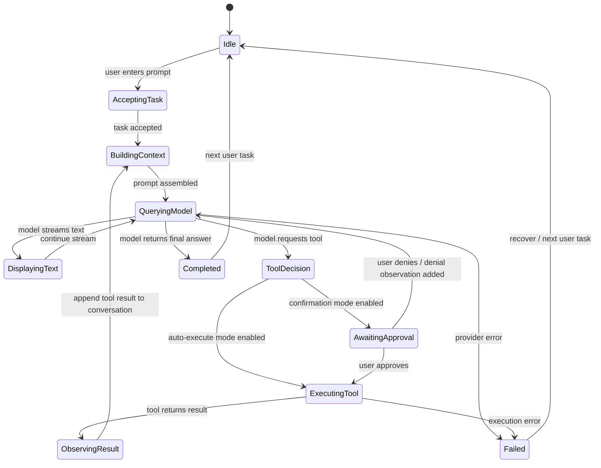

# State Diagram

Use this Mermaid state diagram directly in markdown-capable viewers or convert it to an image for the repo/demo.

## State explanations

- **Idle**: system waiting for input
- **AcceptingTask**: task capture and initial validation
- **BuildingContext**: prepare system prompt, tool list, conversation state
- **QueryingModel**: ask model for next action
- **DisplayingText**: show streamed assistant tokens
- **ToolDecision**: model has selected a tool call
- **AwaitingApproval**: optional user confirmation step
- **ExecutingTool**: MCP tool or shell-like action is running
- **ObservingResult**: output is normalized and appended to state
- **Completed**: task finished
- **Failed**: unrecoverable error or max-iteration stop
