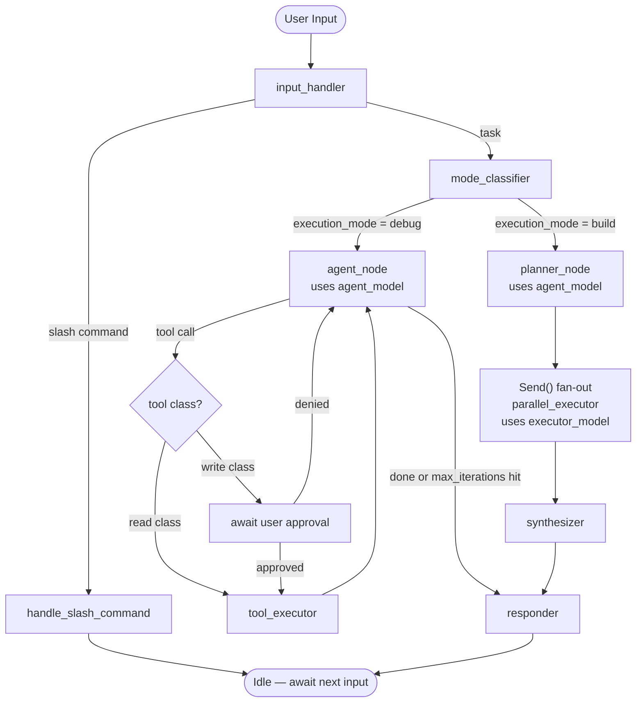

# State Diagram

This diagram reflects the LangGraph node topology. Use it in markdown-capable viewers or convert to an image for the repo/demo.

## Node explanations

| Node | Role |
|---|---|
| `input_handler` | Entry point. Detects `/` slash commands and routes them out early; otherwise passes to `mode_classifier` |
| `handle_slash_command` | Handles `/mode debug`, `/mode build`, `/help`, `/exit`; confirms switch to user |
| `mode_classifier` | Reads `AgentState.execution_mode`; routes to debug or build subgraph |
| `agent_node` | ReAct agent step (debug mode). Calls LLM, decides tool call or final answer |
| `tool_executor` | Runs the MCP tool requested by `agent_node`; appends result to state |
| `await user approval` | Write-class tool in debug mode: blocks until user approves or denies |
| `planner_node` | Build mode entry. Calls `planner.py` to produce `state["plan"]` |
| `parallel_executor` | Executes one plan step (invoked N times via `Send()` fan-out) |
| `synthesizer` | Collects all `parallel_executor` results; assembles final context |
| `responder` | Shared exit node. Streams final answer to CLI; saves to history |

## Confirmation rules (tool_executor path)

| Tool class | debug mode | build mode |
|---|---|---|
| read | auto-execute | auto-execute |
| write | prompt every call | prompt once per type per batch |
