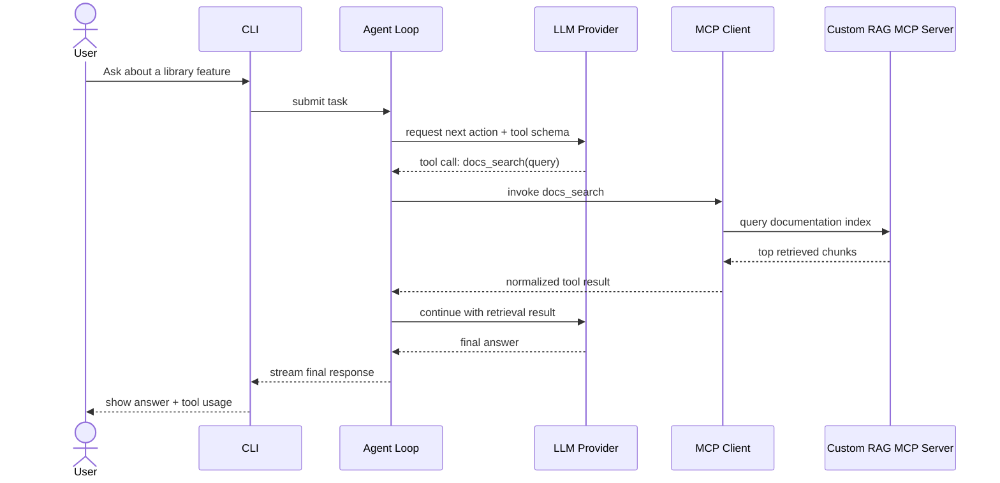
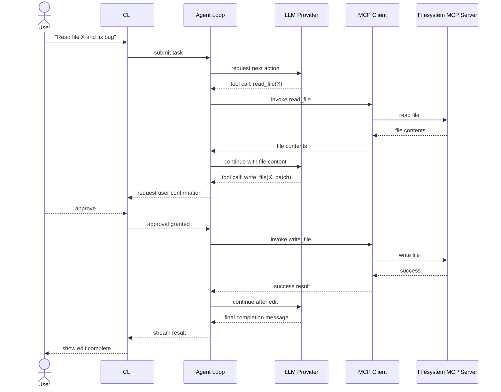
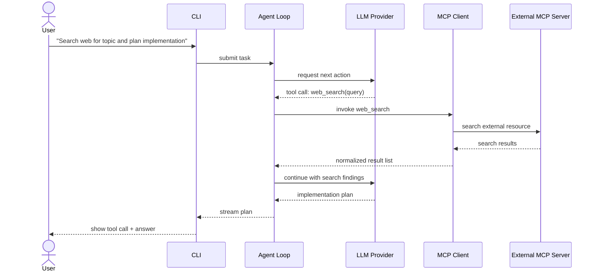

# Sequence Diagrams

## Scenario 1: Ask documentation question through RAG MCP server

## Scenario 2: Read file and make edit with confirmation mode

## Scenario 3: Search web and create implementation plan

